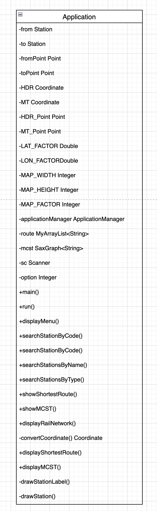
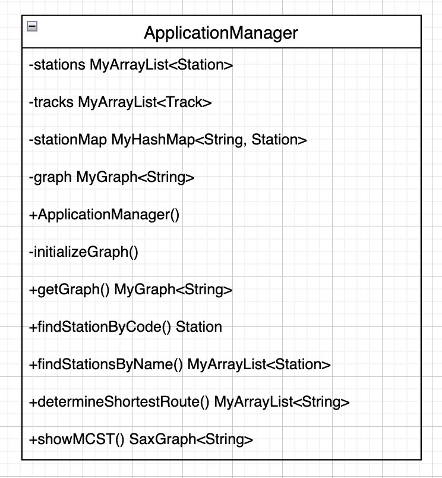
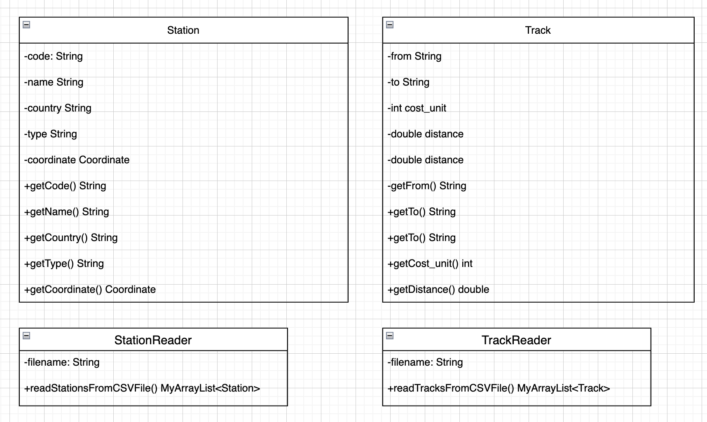

# Algoritmen en klassen

## MyArrayList
Implementation: [my_implementation](../src/nl/saxion/cds/solution/MyArrayList.java)

MyArryList is a custom implementation for the SaxList, SaxSearchable, SaxSortable interfaces. During the class we had a live coding session with our teacher, where he showed us the implementation of binary and linear searches. Additionally, we had a discussion about and code examples about simple and quick sorts. 

### My binary search algorithm
Big-O complexity: O(log(N)) ([source](https://medium.com/@samip.sharma963/binary-search-and-its-big-o-3333d13bd6ec)). The time complexity arises from how the algorithm works: each iteration halves the size of the search space. Since each division of the array takes constant time, the algorithm runs in O(log N) time.

Implementation: [my_implementation](../src/nl/saxion/cds/solution/MyArrayList.java).

#### Explanation
I begin with a collection of sorted items, set 2 pointers: one at the beginning of the collection ans the other at the end. Then i divide the collection into 2 halves by finding the middle point. based on the comparison result i made with the target element, i move left pointer to just after the middle if the middle element is less than the target. Move the right pointer to just before the middle if the middle element is greater that the target. if the middle element is equal to the target, i return its pointion afterwards. Finally, if loop exits without finding the target, -1 will be returned. 

Based on how the algorithm works, this time complexity is due to the nature of how the algorithm work itself. It reduces the problem size by half with each iteration of the loop. Since the loop runs O(log n) times and each iteration is O(n), the overall time complexity is O(log n).

#### Tests
One part of the test method named [GivenLargeList_WhenMakingChanges_ConfirmStateRemainsCorrect](../test/collection/TestMyArrayList.java) checks for proper implemented algorithm:

- Correctness for specific elements: It verifies that the binary search correctly finds the specific element (first, last, second-to-last). For each element, it compares the value found at the retured index with the original element.
- Handling missing elements: It tests for the element that is not present in the list.

### My linear search algorithm
Big-O complexity: O(N). Linear search has a time complexity of O(N) because, in the worst case, it must examine every element.

Implementation: [my_implementation](../src//nl/saxion/cds/solution/MyArrayList.java)

#### Explanation
A linear search algorithm traverses the entire array from start to end using a loop. If the element at the current index is equal to the target element, then it returns the index; otherwise, it goes to the next element of the array. If the target element is not found in the array, it returns -1.

Linear search has a time complexity of O(N) because, in the worst scenario, it need to go all over the list to find the needed element or determine that the value is not present. Worth noticing that the time required grows reapidly with the size of the list. 

#### Tests
One part of the test method named [GivenLargeList_WhenMakingChanges_ConfirmStateRemainsCorrect](../test/collection/TestMyArrayList.java) checks for proper implemented algorithm:

- Correctness for specific elements: It verifies that the binary search correctly finds the specific element (first, last, second-to-last). For each element, it compares the value found at the retured index with the original element.
- Handling missing elements: It tests for the element that is not present in the list.

### My SimpleSort Algorithm
Big-O complexity: O(n^2). The algorithm’s nested loops mean that for each element in the list, it potentially compares with every other unsorted element, leading to O(N²) time complexity.

Implementation: [my_implementation](../src/nl/saxion/cds/solution/MyArrayList.java)

#### Explanation
For selection sort, the Big O time complexity is O(n²) because it involves two nested loops—one to iterate over the array and the other to find the smallest element. Selection sort works by ensuring that after each iteration, the smallest unsorted element is placed in its correct position in the list. By the end of the process, all elements are sorted. Firstly, we iterate over the list. During each iteration, another loop is created to search for the smallest element in the unsorted portion of the list. This loop compares each element with the current smallest element and then updates the smallest element index if a smaller element is found. The algorithm executes until the list is finally sorted. 

#### Tests
Test [GivenLargeList_WhenMakingChanges_ConfirmStateRemainsCorrect](../test/collection/TestMyArrayList.java) checks multiple things, but it also makes sure that simple sort works as expected. We firstly check if elements at the beggining are not sorted and then sort them using this algorithm and theck 1 more time if list is really sorted then. 


### My QuickSort algorithm
Big-O complexity: O(n log n) ([source](https://www.tutorchase.com/answers/a-level/computer-science/what-is-the-big-o-notation-of-the-quicksort-algorithm)). The best-case scenario for Quicksort occurs when the pivot element selected during each partition step divides the array exactly in half. In this case, the time complexity is O(n log n) ([source](https://www.tutorchase.com/answers/a-level/computer-science/what-is-the-big-o-notation-of-the-quicksort-algorithm)).

Implementation: [my_implementation](../src/nl/saxion/cds/solution/MyArrayList.java)

#### Explanation
The algorithm selects a "pivot" element from a list as a first element. The array is rearranged so that all elements less than pivot are moved to its left and all greater elements that the pivot are moved to its right. Then i have a seperate method that uses 2 pointers that traverse the list from both ends towards the center. Elements are swapped based on their comparison with the pivot until the pointers cross each other. Once we have found the correct pivot position, quick sort is then recursively called to the sub-arrays from left-to-right and right-to-left. 

With regards to the time complexity, we divide the list into 2 roughly equal halves that requires a linear time O(n).  If the pivot divides the aaray each time, the number of levels in the recursion tree will be about Log n. Consequently, each level of the recursion requires O(n) time to partition nd there are O(log n) levels on average, the total time complexity will be O(n log n).

#### Tests
Test [GivenLargeList_WhenMakingChanges_ConfirmStateRemainsCorrect](../test/collection/TestMyArrayList.java) checks for proper implemented algorithm:

The test ensures that after applying quick sort, the list is correctly sorted. 

Another test [GivenListWithIntegers_WhenQuickSorted_ThenListIsSorted](../test/collection/TestMyArrayList.java): this test ensures not only that the sorting is done correctly, it also provides a validation by checking the list if it is sorted. 

## DoubleLinkedList

Implementation: [my_implementation](../src/nl/saxion/cds/solution/DoubleLinkedList.java)

### My LinearSearch Algorithm
Big O complexity: O(n). Linear search runs in linear time and makes a maximum of n comparisons, where n is the length of the list. 

#### Explanation
This algorithm iterates over all nodes, starting from the head and moving towards the tail. Each iteration takes O(1), but since you mau need to loop over all n nodes, the overall time complexity is O(n). Worst cases, where element is not present or this is a tail. Firsly, we loop through each node and then check if the current node's value matches the element we are looking for. If it is equal - return its position, it not - move to the next node. 

#### Tests
Test [GivenLargeList_WhenMakingChanges_ConfirmStateRemainsCorrect](../test/collection/TestMyDoubleLinkedList.java) searches for an element using linear search. We get the first element from created list, then get the position of its element using linear search and compare the values. 

## My BST
Implementation: [my_implementation](../src/nl/saxion/cds/solution/MyBST.java). Worth saying that our teacher showed us how to implement add, get, getKeys, graphViz methods. 

#### Explanation
The MyBST class implements a generic Binary Search Tree (BST) with nodes that hold key-value pairs. The class supports standard BST operations such as adding, removing, searching, and retrieving all keys, and provides visualization of the tree structure in GraphViz format. 

In the absolute worst case, a binary tree with N elements would be like a linked list.
Hence, there would be N levels, and a search would take N traversals. That's why it's O(N) in the worst case. And this is why we need to balance the trees to achieve O(log N) search. ([reference](https://medium.com/@samip.sharma963/binary-search-tree-and-its-big-o-f75eef7a985))

#### Tests
All tests can be found [here](../test/collection/TestMyBST.java). Overall some tests overview:

[GivenTree_WhenCheckingContains_ConfirmCorrectResults](../test/collection/TestMyBST.java) : It confirms that the method correctly identifies the presence of keys in a populated tree.

[GivenTree_WhenGettingElements_ConfirmCorrectResults](../test/collection/TestMyBST.java) : This ensures that retrieval works accurately.

[GivenTree_WhenMakeChanges_ConfirmExceptionsAreThrown](../test/collection/TestMyBST.java) : This test verifies that error handling works correctly. 

## My HashMap
Implementation: [my_implementation](../src/nl/saxion/cds/solution/MyHashMap.java). Worth saying that our teacher showed us how to implement add, get, remove, getKeys, graphViz, toString methods.

#### Explanation
The Bucket inner class is a simple container for storing key-value pairs. Each bucket can hold one key-value pair or be null. To create a custom HashMap, i have used MyArrayList implemented earlier due to its dynamic resizing. To implement it, i have used linear probing known for its technic to handle collisions in hash tables. When 2 or more keys hash to the same index, linear probing finds the next available slot in a sequential order. This is done by using this code:
```
int hashCode = key.hashCode();
int index = Math.abs(hashCode) % buckets.size();
```
If the calculated index is occupied, it will search for the next open slot:
```
i = (i + 1) % buckets.size();
```

The efficiency of the <b>"contains"</b> method depends on how well the hash function distributes keys across buckets. We have 2 cases:

Average case, where most keys will be in different buckets. Time complexity is O(1).
Worst case, where many keys collide, so the method may acheck several buckets one after the other. Time complexity is O(n).

#### Tests
To prove that all implemented methods work as expected, the [following tests](../test/collection/TestMyHashMap.java) have been written

[GivenEmptyHashMap_WhenAddingValues_ConfirmTheResultsAreCorrect](../test/collection/TestMyHashMap.java) test checks if adding buckets work properly. We check map size, the value by its key, throw an exception if capacity is exceeded.
[GivenHashMap_WhenRemovingValues_ConfirmTheResultsAreCorrect](../test/collection/TestMyHashMap.java) test checkes if removing a bucket works properly, map size changes accordingly, throw exception for invalid key. 

Additional tests cover operations such as retrieving all keys and generating a graphViz representation.


## My MinHeap
Implementation: [my_implementation](../src/nl/saxion/cds/solution/MyMinHeap.java). Worth saying that our teacher showed us how to implement enqueue (percolateUp), dequeue (percolateDown), toString methods. 

#### Explanation
The minHeap is a type of data structure where the root element is always smaller than its child elements. This is done by 2 helper methods: percolateUp and percolateDown. PercolateUp method, which percolates a new item as far up in the tree as it needs to go to maintain the heap property. The percolateDown method ensures that the largest child is always moved down the tree. Because the heap is a complete binary tree, any nodes past the halfway point will be leaves and therefore have no children ([resource](https://runestone.academy/ns/books/published/javads/trees_binary-heap-implementation.html)). For my implementation i have used a custom MyArrayList due to its generic and it can be easity grown in size. 

#### Tests

All tests can be found [here](../test/collection/TestMyMinHeap.java). Overall, i check if all methods work as expected and throw EmptyCollectionException correctly. 

[GivenNewHeap_WhenAddingExampleData_ConfirmSize](../test/collection/TestMyMinHeap.java) test ensures that enqueue method works correctly together with a toString method. We created a new heap and added some integer values. By the end we test the proper order of integers. 

[GivenNewHeap_WhenRemovingExampleData_ConfirmSizeAndStructure](../test/collection/TestMyMinHeap.java) test ensures that dequeue works correctly together with a toString method. We created a new heap and added some integer values. We removed the root element and test the proper order of integers. 

[GivenNewHeap_WhenMakeChanges_ConfirmExceptionsAreThrown](../test/collection/TestMyMinHeap.java) test ensures that exceptions are thrown where needed. 

### My Queue
Implementation: [my_implementation](../src/nl/saxion/cds/solution/MyQueue.java)

#### Explanation
The MyQueue class is a queue implementation using a custom DoubleLinkedList to store its elements. It implements the SaxQueue interface, providing standard queue operations like enqueue, dequeue, peek.  The main concept of this data structure is "First In, First Out", meaning that the first element added to the queue will be the first one to be removed. 

Using DoubleLinkedList is beneficial as it allows to:
- Provide efficient O(1) time complexity for both enqueue and dequeue operations
- Avoid element shifting and dynamically manage array size

#### Tests
All tests can be found [here](../test/collection/MyQueueTest.java). Overall, i check if all methods work as expected and throw "EmptyCollectionException" exception if queue is empty. 


[WhenGivenQueue_WhileMakingChanges_ConfirmResultsAreCorrect](../test/collection/TestMyQueue.java) test ensures that elements are dequeued in the correct order and that peeking at the front of the queue correctly reflects the current state of the queue.

[WhenGivenEmptyQueue_ConfirmItThrowsAnException](../test/collection/TestMyQueue.java) test ensures that the queue correctly handles operations when it is empty by throwing the appropriate exceptions

### My Stack
Implementation: [my_implementation](../src/nl/saxion/cds/solution/MyStack.java)

#### Explanation
The MyStack class is a stack implementation using a custom DoubleLinkedList to store its elements. It implements the SaxStack interface, providing standard stack operations like push, pop, and peek. The main concept of this data structure is "Last In, First Out", meaning that the most recently added element is the first one to be removed. 

Using DoubleLinkedList is beneficial as allows to:
- Perform frequent insertions and deletions without worrying about resizing overhead.
- Avoid the performance hit of dynamic resizing present in ArrayList.

#### Tests
All tests can be found [here](../test/collection/MyStackTest.java). Overall, I check if all methods work as expected and throw "EmptyCollectionException" exception if stack is empty. 

[GivenEmptyStack_WhenPushingAndPoppingElements_ConfirmChangesAreCorrect](../test/collection/TestMyStack.java) test ensures that pushing and popping elements to and from the stack changes the stack's size and content as expected. It also confirms that peeking reflects the correct top element without affecting the stack size.

[GivenEmptyStack_WhenPeekingElement_ConfirmItThrowsException](../test/collection/TestMyStack.java) test ensures that the stack correctly handles the peek operation by throwing the appropriate exception when the stack is empty.

## My Graph
Implementation: [my_implementation](../src/nl/saxion/cds/solution/MyGraph.java)

#### Explanation
A graph is a type of data structure that has nodes and edges (connections between nodes). Each edge can be associated by a weight, meaning the distance between nodes. In my implementation, I have implemented useful methods to build the graph and well-known algorithms to solve issues. To store nodes, I have used a custom MyHashMap, because it allows easily to map over all nodes and get their neighbour edges. I prefered a custom MyArrayList inside MyHashMap to store node’s edges, because, in my opinion, it is better for managing path. We can easily access the edges of each node and iterate over them.  

### My iterative depth first search algorithms

#### Classification: 
O(V + E). Where V is number of nodes and E - number of edges. Every vertex is processed once, meaning O(V). For every vertex, we check its neighbour edges, contributing to O(E) time complexity. ([source](https://en.wikipedia.org/wiki/Depth-first_search)). DFS algorithm is used to explore all nodes in the graph using backtracking. 

#### Implementation:
(The code was developed by understanding the pseudo code from the sheets)

DFS traversal algorithm is part of the iterator implementation of MyGraph. Before all, I have used a stack to keep track of the nodes to be visited. Also, HashMap to keep the nodes we have already visited. During initialization, we push the head node to the stack. By default, iterator has hasNext() and hext() methods. When calling hasNext() we check if we have nodes to visit. We get the last added node from the stack, if this node has not been added to visited, we add it as visited and sets it to the nextValue to be returned. Moving on, we retrieve all the neighbour edges of the current node. Worth noticing, that we loop over neighbour edges in reverse order due to how stack works (LIFO). When we push neighbours to the stack in reverse order, the first neighbour added will be the last popped off the stack. Lastly, for each unvisited node, it pushes it to the stack. Finally, we return a boolean if nextValue is not equal to null. 
next() method gets the next nodeValue. We initialize tempV  in order to set nextValue to null. We do this, because the nextValue won’t change and will return the same value all the time once next() is called.

#### Tests

[GivenEmptyGraph_WhenAddEdges_ConfirmDepthFirstSearchCorrect](../test/collection/TestMyGraph.java) test ensures that DFS algorithm works as expected. We create a graph, by adding edges. Then, we initialize an iterator and check if it traversesthough each node in depth-first order. We confirm that next node exists and that the actual visited node is equal to the expected.

### My Dijkstra algorithm

#### Classification:
O ((V + E) log V). It is determined by the graph’s number of vertices and edges. Using priority queue operations leading us to O (log V) time complexity. ([source](https://www.geeksforgeeks.org/time-and-space-complexity-of-dijkstras-algorithm/)).

#### Implementation:
(The code was developed by understanding the pseudo code from the sheets)

Dijkstra algorithm finds the shortest route from a starting node to all other nodes in a graph. For my implementation I have used MyHashMap to store the visited nodes and MyMinHeap (priority queue) to always get the least costly node next. When the algorithm starts, it creates the variables to store the data and the result. Then it enqueues the starting node with a 0 distance. It enters the loop, where it dequeues the node with the smallest distance and add it to visited nodes and to the result graph. For each of its unvisited neighbours, it calculates a new distance. This process is happening until we have reached all the nodes and finally return the result as a graph. 

#### Tests

[GivenEmptyGraph_WhenAddPaths_ConfirmDijkstraCorrect](../test/collection/TestMyGraph.java) test ensures Dijkstra algorithm works as expected.We create a graph, by adding edges. The we apply Dijkstra algorithm for the first "A" node. The result graph should be equal to 4. Finally, we check the weights of the edges from "A" node.  

### My A* algorithm

#### Classification: 
This is a pathfinding algorithm that uses a heuristic estimate to establich its shortest route between two nodes. It uses the cost from the starting node and the estimated cost to the goal node. Time complexity depends on the quality of the heuristic function. In the worst cases - O(b^d), where b - number of edges from each node and d - number of nodes on the resulting path. The better the heuristic function, the less of these nodes need to be visited, and so the complexity drops. ([source](https://www.baeldung.com/cs/a-star-algorithm)).

#### Implementation:
(The code was developed by understanding the pseudo code from the sheets)

To implement this algorithm, I have used 2 data structures: MyMinHeap (priority queue) - openList. This helps us to store the nodes to be explored and retrieve them with the lowest total estimated cost. MyHashMap - closedList, where we keep the nodes that have been explored to avoid it checking multiple times. 

The algorithm begins by creating a startNode, with inital cost 0 and calculating its heuristic cost from entered both start and end nodes. Every time, it gets the nodes with the lowest cost from the priority queue. If we reached the goal - we found the shortest route and it reconstructs the path using reconstructPath() method. Basically, it moves back from the goal node to the start one, by following its nodes’s parent. In this algorithm, I have used AStarNode, representing each node. It has useful attributes, such as parent, that helps us to keep the reference to the previous node, so we can reconstruct the path. 
 If the goal node has not been reached - we explore all nodes’s neighbours of the current node. For each neighbour, it calculates the actual cost from the start node to the neighbour and then from this neighbour to the endNode (goal). If the current node is not in the closedList, meaning that it has not been explored yet, it gets added to the openList with its calculated costs. Finally, if the shortest route was not found, it returns an empty list. 

#### Tests

[GivenEmptyGraph_WhenAddPaths_ConfirmAStarCorrect](../test/collection/TestMyGraph.java) test ensures that A* algorithm works as expected. Then, we use the algorithm to find the shortest route bentween 2 nodes. As a result, we should get 2 edges. We check that each edge has the correct associated weight.

[GivenEmptyGraph_WhenAddPaths_ConfirmReturnsEmptyArray](../test/collection/TestMyGraph.java) test ensures that the shortest route won't be found for a non-existing node. 

### My MCST algorithm  

#### Classification:
It always depends. In the best scenario is O (E log V), where E - number of edges and V - number of vertices. The algorithm in each iteration selects the smallest weight edge due to priority queue. In the worst cases - O ((V + E) log V), when queue operations lead to the logarithmic time. ([source1](https://www.quora.com/What-is-the-best-algorithm-in-time-complexity-to-compute-the-minimum-spanning-tree-in-a-complete-graph)) - Assistant reply. ([source2](https://www.geeksforgeeks.org/time-and-space-complexity-analysis-of-prims-algorithm/)). 

#### Implementation:
(The code was developed by understanding the Prim's logic in the sheets)

MCST algorithm, used with Prim algorithm to find the minimum possible total edge weight. For this implementation, I have used MyMinHeap (priority queue) to keep the edges to explore with the lowest weight first, MyHashMap to kepp track of explored nodes. Firstly, we add the first node to visisted (can be any node), then we add all the edges connected to the start node to the priority queue. While queue is not empty, we get the edge with the lowest weight from the queue. If the destination node of this node has already been visisted, we continue the process. If this is not true, we then add edge to the result graph and immediately mark the connected node as visited. After that, we again look for its neighbours. If these connected nodes have not been visited yet, we add them to the queue. Once the queue is empty, it means that we have made the minimum cost spanning tree and return the result. 

# Technical design My Application


The Application class is the main part of the console application and helps coordinate all the different parts of the railway network management system. It uses several supporting classes, such as the Station and Track classes. It also uses ApplicationManager class to handle all the logic. (depth explanation below)



The ApplicationManager class is the main component where the logic of the railway network system is implemented. It coordinates data loading, station lookups, route calculations, and minimum cost spanning tree. 
ApplicationManager() constructor: 
The constructor initializes the ApplicationManager by reading station and track data from CSV files. Creating additional data strctures for requirements. 
* stations: MyArrayList<Station> that stores the list of all stations loaded from the CSV file.
* tracks: MyArrayList<Track> containing all the track connections between stations.
* stationMap: MyHashMap<String, Station> that maps station codes (unique identifiers) to Station objects for quick lookup.
* graph: MyGraph<String> structure that represents the railway network as a graph. 

### Methods Explanation (depth explanation below)
#### initializeGraph()
This private method sets up the graph by adding bidirectional edges between stations based on the tracks. Each track represents a connection between two stations, and the method adds this relationship to the graph along with the distance.


#### findStationByCode()
This method allows to easily find any station by its identifier - code. 


#### findStationsByName()
This method allows to easily find any stations by name.

#### findStationsByType()
This method retrieves all stations that match a specific type.

#### determineShortestRoute()
This method calculates the shortest route between two stations using the A* algorithm. It uses the Haversine formula to esitmate the distance between 2 stations. It also shows the result in the console. 

#### showMCST()
This method connects all stations with the least total track distance and show the results in the console. 

## Class diagram and reading the data



The ApplicationManager uses StationReader and TrackReader classes to read data from CSV files. Both are stored inside the custom MyArrayList. ArrayList was choosen due to dynamic rezising and easy access elements at any place. An alternative could be the custom DoubleLinkedList, but using it would result in slower access time and higher memory usage. [MyArrayList Explanation](#myarraylist) and [DoubleLinkedList Explanation](#doublelinkedlist)

# Station search by station code

The method findStationByCode retrieves a station from the custom MyHashMap, where each station’s code is a key and the associated station is a value. I have decided to use this implementation based on the unique station code, that will ensure that we only get one station. An alternative could be the custom MyArrayList. In this case, time complexity would depend on the stations size, because it will have to go over all stations to find the exact code, meaning it would be less efficient. 

# Station search based on the beginning of the name

The method findStationsByName finds all stations that start with the given substring. I have decided to use the custom MyArrayList, because it is easy to impement and the insertion order remains unchanged. To implement this requirement I looped over all stations and created a condition that would match the provided substring with all possible names using «startsWith» string method. An alternative data structure could be the custom MyHashMap, where the key would be a substirng of station names, and the value would be an array of all stations that start with that substring. However, if we want to get not a single station, but all possible matches, it makes the implementation harder. In my opinion, this approach would probably reduce the time complexity for lookups.

# Station search based on the type

The method findStationByType finds all stations that match a specific type. I have decided to use the custom MyArrayList, similar to findStationByName method, because it allows for easy implementation and maintains the insertion order.
To implement this, I looped over all stations and created a condition to check if the station’s type metches the provided type using «equals» string method. After calling all matching stations, I used [simpleSort](#my-simplesort-algorithm) algorithm, implemented inside MyArrayList to sort stations in alphabetical order by name. An alternative data structure would be the custom MyHashMap, where the key would be the station type and the value would be MyArrayList containing all stations of that type. However, in my opinion, this would result in more complex implementation using multiple lists for above said logic. With regards to sorting, we could also use [quickSort](#my-quicksort-algorithm) algorithm. As a result, It will be* faster due to time complexity.

## Implementation shortest route

The determineShortestRoute() method is used to determine the shortest route between two stations using a heuristic for distance estimation. In-depth explanation about A* algorithm implementation [here](#my-a-algorithm).
This method receives 2 station codes from user, where we find the actual stations using findStationByCode() method implemented earlier. We need them to make an estimate from one station to another using heuristic function. Then we use shortestPathAStar algorithm from SaxGraph interface. After the shortest route has been found, we calculate the total distance and display the found route by looping over each node’s neighbour and get their weight. 
To store the found path, I could use either the customer MyArrayList or DoubleLinkedList. In my opinion, using MyArrayList is better option, because the time complexity for adding elements is O(1). If we decide to use DoubleLinkedList, it will require more time to put the correct pointers between nodes.
With regards to finding the shortest route, we could also use Dijkstra algorithm for this purpose. A* algorithm uses a heuristic function to prioritize nodes that are closer to the destination, so we skip unnecessary nodes. In contrast, Dijkstra algorithm does not use a heuristic, so it explores more nodes. In-depth explanation about Dikstra algorithm implementation [here](#my-dijkstra-algorithm)


## Implementation minimum cost spanning tree 

The showMCST() calculates and displayes all nodes with the minimum total edge weight. We call our minimumCostSpanningTree() method to get the result with SaxGraph type. Then we iterate over all nodes in the graph and for each node individually we again iterate to get its neighbours edges. Based on each edge we calculate the total length and connection count. An alternative for SaxGraph, we could use the custom MyHashMap, where the key is node and the value - a list of its edges. In this case, time complexity for getting edges for each node is O(1). In-depth explanation about MCST algorithm implementation [here](#my-mcst-algorithm)

## Implementation graphic representations

The application provides a graphical rail network representation on the Netherlands image. In order to implement this functionality, we have to convert latituge and longitude into 2D points. Each station has a geographical coordinate defined by latitude and longitude. By default, two reference coordinates are created: HDR and MT and their corresponsing points on the map. We use two factors to convert the geographical coordinates: LAT_FACTOR (the ratio of the vertical distance on the screen to the difference in latitude) and LON_FACTOR (the ratio of the horizontal distance on the screen to the difference in longitude). 
Now we have everything in order to display it on the screen. For this purpose, I have used SaxionApp, because this is the easiest way to implement it. 

#### displayShortestRoute() 
Method displays the shortest route between two stations on the map. After calculating the route using station codes, it draws the path by connecting each station in the route one by one. It displays the station in a circle together with its name (from start station to goal station). Each station is connected along the route. 

#### displayMCST() 
Method displays the MCST of the rail network, showing the least number of rail connections. The same principle applies here for graphical representation. It displays the station in a circle together with rail connections between each station. 
 
#### displayRailNetwork() 
Method provides a full view of the rail network. It shows all stations and their rail connections on the map. It displays the station in a circle together with rail connections.

